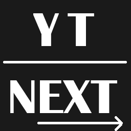
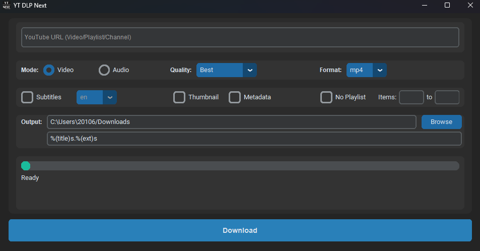

# Meet YT DLP Next – The Python YouTube DLP Wrapper  

YT DLP Next is a **modern, clean, and lightweight graphical user interface (GUI)** for [yt-dlp](https://github.com/yt-dlp/yt-dlp).  
I built it to make downloading videos and audio easier, without needing to type complex command-line options.  

## ✨ Features  
- 🎥 Download **video** or **audio** with a single click  
- 🎚 Select **quality** and **format** (mp4, mp3, etc.)  
- 🌍 Subtitle support with language selection  
- 🖼 Optional download of thumbnails and metadata  
- 📂 Clean file naming and customizable output folder  
- 🖤 Minimal, modern, and user-friendly design  

## 🚀 Getting Started  
1. Install ffmpeg (If using the executeable without installing python).  
2. Download the latest release of YT DLP Next and Extract it.  
3. Run the executable `YT DLP Next.exe`  (or `python main.py` if using the source).  
4. Paste your video/playlist/channel URL and hit **Download**.  

## 📷 Screenshots  

## ⚖️ Disclaimer  
YT DLP Next is **only a graphical wrapper** for [yt-dlp](https://github.com/yt-dlp/yt-dlp).  
It does not modify yt-dlp or bypass its license.  

Please use this software **responsibly** and only download content you have the rights to (your own uploads, open-licensed media, personal archives, etc.).  
I do not endorse or encourage the unauthorized downloading of copyrighted material.  

## 📜 License  
- YT DLP Next is licensed under **MIT License** 
- yt-dlp is licensed separately under the [Unlicense](https://github.com/yt-dlp/yt-dlp#license).  

## 🙏 Credits  
- Built with ❤️ by me, in Python.  
- Powered by [yt-dlp](https://github.com/yt-dlp/yt-dlp).  
